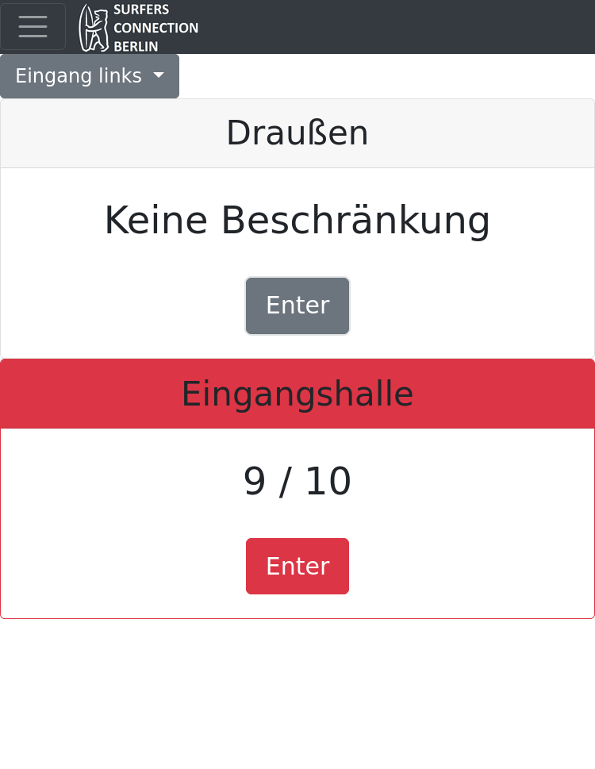

# Roomcounter Web-Application

Small web-application that was developed for and used for the [German Rapid Surf League Championships in 2023](https://wellenreitverband.de/events/rapid-surf-dm-2020) in Berlin.

The application was used for counting the current number of visitors in the different rooms of the competition venue by counting visitor in- and outflow at the various doors.
This allowed adhering to the various Covid-19 regulations imposed upon the event.

The backend written in Python using FastAPI. The frontend is based on vue.js and bootstrap and facilitates websockets for bidirectional communication.
